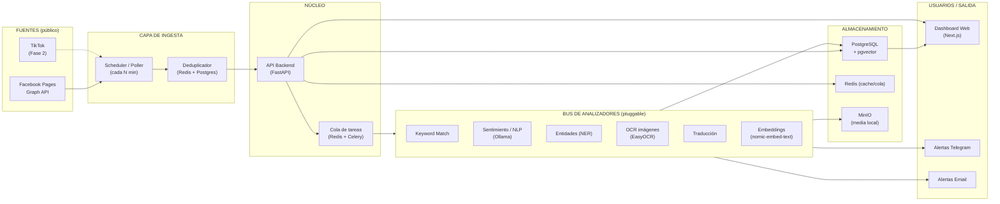

# Plataforma OSINT de Monitoreo de Fuentes Abiertas (inspirada en Intelion)
### Documento de Arranque para Claude Code — v1.0

> **Propósito de este documento:** Servir como punto de partida (PRD + especificación técnica) para construir, con Claude Code, una aplicación web local de monitoreo de **páginas públicas** de redes sociales (Facebook primero, TikTok después), inspirada conceptualmente en la plataforma **Intelion by ISID**.
>
> **Alcance legal clave:** El sistema monitorea **PÁGINAS PÚBLICAS** (no perfiles personales) usando **APIs oficiales**. No se contempla scraping de perfiles personales ni interceptación de comunicaciones privadas.

---

## Índice

1. [Referencia conceptual: Intelion by ISID](#1-referencia-conceptual-intelion-by-isid)
2. [Viabilidad para Facebook (según lo analizado)](#2-viabilidad-para-facebook)
3. [Arquitectura propuesta (local)](#3-arquitectura-propuesta-local)
4. [Stack tecnológico](#4-stack-tecnológico)
5. [Modelo de datos](#5-modelo-de-datos)
6. [Bus de analizadores (módulos)](#6-bus-de-analizadores-módulos)
7. [Endpoints y flujos](#7-endpoints-y-flujos)
8. [Infraestructura local (Docker Compose)](#8-infraestructura-local-docker-compose)
9. [Roadmap por fases](#9-roadmap-por-fases)
10. [Consideraciones legales y de privacidad](#10-consideraciones-legales-y-de-privacidad)

---

## 1. Referencia conceptual: Intelion by ISID

**Intelion** es la plataforma insignia de **ISID** (empresa española y global), un software centrado en operaciones para **Investigación de Medios y Monitoreo OSINT**, orientado a fuerzas del orden y agencias de inteligencia. Su premisa: **reducir los tiempos de investigación y análisis a una fracción de lo habitual**, automatizando la revisión y documentación de vídeo, audio, imágenes y documentos.

### 1.1. Diagrama de arquitectura de referencia


> *"Introduce datos de cualquier fuente. Genera información útil con cualquier analizador."*

### 1.2. Bondades / capacidades que ofrece Intelion

| # | Capacidad | Descripción |
|---|-----------|-------------|
| 1 | **Bus de IA agnóstico** | Capa de análisis intercambiable ("hot-swap") que se conecta a cualquier analizador del mercado. Permite usar varios analizadores del mismo tipo (ej. facial) de distintos proveedores en paralelo, aprovechando las fortalezas de cada uno. Reduce el costo total de propiedad y la curva de aprendizaje. |
| 2 | **Ingesta multi-fuente** | VMS/Video, cámaras, TV/Radio/Streaming, audios, redes/escuchas sociales, prensa online/escrita, archivos multimedia/documentos y repositorios históricos. |
| 3 | **Análisis masivo 24/7** | Procesa miles de streams simultáneamente sin intervención humana, siempre cumpliendo leyes de privacidad. |
| 4 | **Capa de ingesta** | *Grabadores* (capturan señales en vivo) + *Carpetas de escucha* (procesan archivos depositados automáticamente). |
| 5 | **Automatización de flujo (BPM)** | Motor de Business Process Management que inicia tareas analíticas automáticamente según reglas predefinidas. |
| 6 | **Gestión de permisos** | Control de acceso por usuario/rol. |
| 7 | **Almacenamiento centralizado** | Resultados, logs y evidencias unificados en una sola pantalla. |
| 8 | **Salida a terceros vía API** | Integración con bases de datos externas y plataformas de terceros (cruce de datos). |
| 9 | **Búsquedas, reportes y alarmas** | Alertas programables por email o sistemas de mensajería; informes resumidos automáticos. |
| 10 | **Investigación geoespacial** | Definición de zonas "de paso", detección de rutas a partir de una identificación, detección de convoyes, todo sobre mapa (GIS). |
| 11 | **Monitoreo del dominio cognitivo** | Monitoriza TV, radio, streaming, redes sociales y web 24/7; localiza palabras clave; analiza el **sentimiento público** vía NLP. |
| 12 | **Cumplimiento de privacidad** | Difumina contexto circundante; análisis facial por *similitud* en lugar de perfilado biométrico. |
| 13 | **Despliegue flexible** | Cloud, on-premise o híbrido. |

### 1.3. Analizadores del "Bus de analíticas" (según el diagrama)

- **Facial** — reconocimiento facial
- **Objetos** — detección de objetos
- **ALPR** — reconocimiento automático de matrículas
- **VMMR** — marca/modelo/color de vehículos
- **OCR** — texto en imágenes/documentos
- **S2T** — Speech-to-Text (transcripción)
- **AFP** — Audio Fingerprinting
- **Speaker ID** — identificación de locutor
- **NLP** — procesamiento de lenguaje natural (sentimiento, entidades)
- **Traducción** — traducción automática
- **GIS** — geolocalización / mapas
- **IoT** — integración con sensores

### 1.4. Versiones comerciales

- **Intelion Media Investigation** — investigaciones policiales/inteligencia; ingesta masiva de archivos/señales.
- **Intelion Media & OSINT Intelligence Monitor** — monitoreo de fuentes abiertas 24/7; unifica TV, radio, redes y prensa para generar inteligencia.

> **Lo que replicaremos (versión aterrizada y legal):** un subconjunto del *OSINT Intelligence Monitor* — ingesta de **páginas públicas de redes sociales**, con un **bus de analizadores** (keyword matching + sentimiento NLP + OCR + traducción + embeddings), almacenamiento centralizado, dashboard, y **alertas** vía Telegram/email.

---

## 2. Viabilidad para Facebook

**Conclusión: SÍ es viable para PÁGINAS públicas. NO para perfiles personales.**

### 2.1. La distinción crítica: Página vs Perfil

| | **Página pública** (Page) | **Perfil personal** |
|---|---|---|
| Acceso vía Graph API oficial | ✅ Sí | ❌ No (bloqueado a terceros) |
| Legalidad del monitoreo | Zona limpia | Zona gris / riesgosa |
| ¿Requiere scraping? | No | Sí (viola ToS de Meta) |
| **¿Lo soportamos?** | ✅ **SÍ** | ❌ **NO** |

### 2.2. Cómo detectar si un objetivo es Página o Perfil

**Regla mental:** si puedes darle *"Me gusta / Seguir"* → **Página** (monitoreable). Si solo *"Agregar a amigos"* → **Perfil** (fuera de alcance).

**Prueba técnica definitiva (Graph API):**
```
GET https://graph.facebook.com/v25.0/{id}?fields=id,name,category&access_token=TOKEN
```
- Devuelve `category` (ej. `"Government Official"`, `"News & Media Website"`) → **es una Página** → luz verde.
- Devuelve error de permisos / sin `category` → **es un perfil** → fuera de alcance.

> **Esta llamada debe implementarse como filtro automático de validación** al registrar un nuevo objetivo en el sistema.

### 2.3. Qué expone la Graph API para una Página pública

| Endpoint | Devuelve | Uso en el sistema |
|----------|----------|-------------------|
| `GET /{page-id}?fields=name,category,fan_count,followers_count` | Metadatos de la página | Validación + ficha |
| `GET /{page-id}/posts` | Publicaciones publicadas | Detección de posts nuevos |
| `GET /{page-id}/feed` | Feed (posts + algunas interacciones) | Monitoreo ampliado |
| `GET /{page-id}/live_videos` | Directos, con estado `LIVE`/`VOD` | **Detección de live iniciado** (¡en el mismo poll!) |

> **Nota:** el polling cada N minutos a `/posts` y `/live_videos` **resuelve ambos requerimientos** (post nuevo + live iniciado) en una sola pasada.

### 2.4. Requisitos de acceso a la Graph API (IMPORTANTE — leer antes de codificar)

1. **App de Meta for Developers** con `App ID` + `App Secret`.
2. **Token de acceso:**
   - Para páginas que la organización **administra**: `Page Access Token` con permisos `pages_read_engagement`, `pages_read_user_content`. Camino más simple.
   - Para páginas públicas de **terceros** que NO administras: se requiere la feature **`Page Public Content Access`**, que exige **App Review + Business Verification** de Meta. Es el principal cuello de botella burocrático; planificarlo con antelación.
3. **Rate limits:** la Graph API aplica límites por app/hora. El scheduler debe respetarlos (backoff + cache).
4. **Alternativa académica (NO tiempo real):** el *Meta Content Library* (sucesor de CrowdTangle) está restringido a instituciones académicas/sin fines de lucro aprobadas, retrasa el acceso a datos y limita exportación. **No sirve para alertas en tiempo real.** Se documenta solo como referencia.

### 2.5. Límite de cobertura

Las herramientas de monitoreo suelen soportar ~100 páginas por cuenta de negocio conectada; se puede ampliar conectando más cuentas. Diseñar el sistema para escalar horizontalmente en número de páginas.

---

## 3. Arquitectura propuesta (local)

Réplica aterrizada del patrón Intelion: **Fuentes → Ingesta → Núcleo → Bus de analizadores → Almacenamiento → Usuarios/Alertas**, todo **on-premise / local** (sin nube).



### 3.1. Flujo de datos (end-to-end)

1. **Scheduler** dispara cada N minutos (configurable por página) una consulta a la Graph API: `/posts` + `/live_videos`.
2. **Deduplicador** compara los IDs recibidos contra los ya vistos (Redis para velocidad, Postgres como fuente de verdad).
3. Los ítems **nuevos** se encolan (Celery/Redis).
4. El **bus de analizadores** procesa cada ítem: keyword matching → sentimiento → NER → (OCR si hay imagen) → embeddings.
5. Resultados y evidencias se guardan en **PostgreSQL + pgvector** (media en MinIO).
6. Si se dispara una **regla de alerta** (keyword crítica, sentimiento negativo, live iniciado) → notificación a **Telegram/email**.
7. El **dashboard** muestra detecciones, timeline, sentimiento, búsqueda semántica y reportes.

---

## 4. Stack tecnológico

> Alineado con el stack que ya dominas: **WSL2 + Docker + VS Code sobre Windows 11**, Next.js, PostgreSQL, Prisma, Redis, Ollama, Telegram.

### 4.1. Frontend

| Componente | Tecnología | Justificación |
|-----------|-----------|---------------|
| Framework | **Next.js 15** (App Router) + **React 19** + **TypeScript** | Ya lo usas en tus proyectos (Bennett, FOXINT). |
| Estilos | **TailwindCSS** + **shadcn/ui** | UI rápida, componentes accesibles. |
| Data fetching | **TanStack Query (React Query)** | Cache, refetch, estados de carga. |
| Gráficos | **Recharts** | Dashboards de sentimiento/volumen. |
| Mapas (GIS) | **MapLibre GL** / **Leaflet** | Módulo geoespacial (opcional Fase 3). |
| Tablas | **TanStack Table** | Grillas de detecciones. |
| Estado | **Zustand** | Estado ligero de UI. |

### 4.2. Backend

| Componente | Tecnología | Justificación |
|-----------|-----------|---------------|
| API principal | **FastAPI (Python 3.12)** | Ideal para la capa de analítica/ML; async nativo. Encaja con tu perfil Data Science. |
| Cola de tareas | **Celery + Redis** | Procesamiento asíncrono del bus de analizadores. |
| Scheduler | **Celery Beat** / **APScheduler** | Polling periódico por página. *(Opción alterna: orquestar con **n8n** que ya dominas.)* |
| ORM | **SQLAlchemy 2.0** + **Alembic** | Migraciones. *(Si prefieres, la capa app en Next.js puede usar Prisma.)* |
| Validación | **Pydantic v2** | Esquemas y settings. |
| Cliente Graph API | **httpx** (async) | Llamadas a Meta. |

### 4.3. Capa de IA / Analizadores

| Analizador | Tecnología local | Nota |
|-----------|-----------------|------|
| Keyword match | Regex + **spaCy** (matcher) | Rápido, sin GPU. |
| Sentimiento / clasificación | **Ollama** (ej. `llama3.1` / `qwen2.5`) | LLM local; prompt de clasificación. |
| Embeddings | **Ollama** `nomic-embed-text` | Ya lo usas; para búsqueda semántica. |
| NER (entidades) | **spaCy** (`es_core_news_lg`) | Personas, lugares, orgs. |
| OCR (imágenes de posts) | **EasyOCR** / **Tesseract** | Texto embebido en imágenes. |
| Traducción | **Ollama** / **argos-translate** | Normalizar idioma antes de NLP. |
| S2T (Fase futura, si hay VOD de lives) | **faster-whisper** | Transcripción de directos grabados. |

### 4.4. Almacenamiento

| Componente | Tecnología | Uso |
|-----------|-----------|-----|
| Base relacional + vectorial | **PostgreSQL 16 + pgvector** | Datos + búsqueda semántica. Ya lo usas. |
| Cache / cola / dedup | **Redis 7** | Velocidad. |
| Media local (S3-compatible) | **MinIO** | Imágenes/vídeos descargados, 100% local. |

### 4.5. Alertas / Notificaciones

- **Telegram Bot API** (ya integrado en tus proyectos previos).
- **SMTP local** (email).
- **WebSocket** (notificaciones en vivo en el dashboard).

---

## 5. Modelo de datos

Esquema PostgreSQL inicial (simplificado):

```sql
-- Objetivos monitoreados (SOLO páginas)
CREATE TABLE pages (
    id              BIGSERIAL PRIMARY KEY,
    fb_page_id      TEXT UNIQUE NOT NULL,
    name            TEXT NOT NULL,
    category        TEXT NOT NULL,          -- validado vía Graph API
    platform        TEXT NOT NULL DEFAULT 'facebook',  -- facebook | tiktok
    fan_count       INTEGER,
    followers_count INTEGER,
    poll_interval   INTEGER DEFAULT 300,    -- segundos (5 min)
    is_active       BOOLEAN DEFAULT TRUE,
    created_at      TIMESTAMPTZ DEFAULT now()
);

-- Publicaciones capturadas
CREATE TABLE posts (
    id              BIGSERIAL PRIMARY KEY,
    page_id         BIGINT REFERENCES pages(id),
    platform_post_id TEXT UNIQUE NOT NULL,  -- para dedup
    type            TEXT NOT NULL,          -- status | photo | video | live
    message         TEXT,
    permalink       TEXT,
    media_urls      JSONB,
    is_live         BOOLEAN DEFAULT FALSE,
    live_status     TEXT,                   -- LIVE | VOD | null
    published_at    TIMESTAMPTZ,
    captured_at     TIMESTAMPTZ DEFAULT now()
);

-- Resultados del bus de analizadores
CREATE TABLE detections (
    id              BIGSERIAL PRIMARY KEY,
    post_id         BIGINT REFERENCES posts(id),
    analyzer        TEXT NOT NULL,          -- keyword | sentiment | ner | ocr
    result          JSONB NOT NULL,         -- payload flexible
    score           REAL,
    created_at      TIMESTAMPTZ DEFAULT now()
);

-- Embeddings para búsqueda semántica
CREATE TABLE post_embeddings (
    post_id         BIGINT PRIMARY KEY REFERENCES posts(id),
    embedding       vector(768)             -- nomic-embed-text
);

-- Reglas de palabras clave / alerta
CREATE TABLE keyword_rules (
    id              BIGSERIAL PRIMARY KEY,
    label           TEXT NOT NULL,
    keywords        TEXT[] NOT NULL,
    match_type      TEXT DEFAULT 'any',     -- any | all | phrase
    severity        TEXT DEFAULT 'medium',  -- low | medium | high
    notify_channels TEXT[] DEFAULT '{telegram}',
    is_active       BOOLEAN DEFAULT TRUE
);

-- Alertas emitidas
CREATE TABLE alerts (
    id              BIGSERIAL PRIMARY KEY,
    post_id         BIGINT REFERENCES posts(id),
    rule_id         BIGINT REFERENCES keyword_rules(id),
    channel         TEXT NOT NULL,
    status          TEXT DEFAULT 'sent',
    sent_at         TIMESTAMPTZ DEFAULT now()
);

-- Usuarios y roles (RBAC — reutilizar patrón de Bennett)
CREATE TABLE users (
    id       BIGSERIAL PRIMARY KEY,
    email    TEXT UNIQUE NOT NULL,
    role     TEXT NOT NULL DEFAULT 'analyst', -- admin | analyst | viewer
    ...
);
```

---

## 6. Bus de analizadores (módulos)

Réplica del **"bus de analíticas agnóstico"** de Intelion: cada analizador es un **plugin intercambiable** que implementa una interfaz común. Se pueden activar/desactivar por página y encadenar.

```python
# Interfaz base (contrato del bus)
class Analyzer(ABC):
    name: str
    @abstractmethod
    async def analyze(self, post: Post) -> DetectionResult: ...
```

**Analizadores de la Fase 1 (mínimo viable):**
1. `KeywordAnalyzer` — matching contra `keyword_rules`.
2. `SentimentAnalyzer` — Ollama LLM → positivo/negativo/neutro + score.
3. `LiveDetector` — marca `is_live` y dispara alerta inmediata.

**Fase 2:**
4. `NERAnalyzer` — spaCy (personas, lugares, organizaciones).
5. `OCRAnalyzer` — EasyOCR sobre imágenes del post.
6. `EmbeddingAnalyzer` — genera vector para búsqueda semántica.

**Fase 3+:**
7. `TranslationAnalyzer`, `S2TAnalyzer` (para VODs de lives), `GISEnricher`.

> Diseñar el registro de analizadores con **auto-discovery** (patrón plugin) para que agregar uno nuevo no requiera tocar el núcleo — igual que el "hot-swap" de Intelion.

---

## 7. Endpoints y flujos

### API Backend (FastAPI)

```
# Gestión de páginas
POST   /api/pages                  # registrar (valida Página vs Perfil vía Graph API)
GET    /api/pages                  # listar
GET    /api/pages/{id}             # detalle + stats
PATCH  /api/pages/{id}             # editar intervalo/estado
DELETE /api/pages/{id}

# Publicaciones y detecciones
GET    /api/pages/{id}/posts       # timeline
GET    /api/posts/{id}/detections  # análisis de un post
GET    /api/search?q=...           # búsqueda semántica (pgvector)

# Reglas de alerta
POST   /api/rules                  # crear regla de keywords
GET    /api/rules
PATCH  /api/rules/{id}

# Alertas y reportes
GET    /api/alerts                 # historial
GET    /api/reports/summary        # informe agregado (volumen, sentimiento)
POST   /api/reports/export         # exportar PDF/CSV

# Tiempo real
WS     /ws/alerts                  # push de alertas al dashboard
```

### Flujo de registro de una página (validación)

```
Usuario ingresa URL/ID → Backend llama GET /{id}?fields=category
  ├── tiene category  → es Página  → guarda + activa polling ✅
  └── error/sin cat.  → es Perfil  → RECHAZA con mensaje explicativo ❌
```

---

## 8. Infraestructura local (Docker Compose)

**Todo corre en local. Sin nube.** Estructura de servicios:

```yaml
# docker-compose.yml (esquema)
services:
  frontend:        # Next.js 15         → :3000
  backend:         # FastAPI            → :8000
  worker:          # Celery worker (bus de analizadores)
  beat:            # Celery Beat (scheduler de polling)
  postgres:        # PostgreSQL 16 + pgvector → :5432
  redis:           # Redis 7            → :6379
  minio:           # MinIO (media)      → :9000
  ollama:          # Ollama (LLM+embeddings) → :11434
  # opcional:
  # n8n:           # orquestación visual → :5678
```

**Requisitos de la máquina local:**
- Docker + Docker Compose (sobre WSL2).
- Ollama con modelos descargados: `nomic-embed-text` + un LLM (`qwen2.5` o `llama3.1`).
- Volúmenes persistentes para Postgres y MinIO.
- Red bridge compartida entre contenedores (patrón que ya manejas para cross-container networking).

**Variables de entorno (.env):**
```
FB_APP_ID=
FB_APP_SECRET=
FB_ACCESS_TOKEN=
GRAPH_API_VERSION=v25.0
POSTGRES_URL=postgresql://...
REDIS_URL=redis://redis:6379/0
OLLAMA_HOST=http://ollama:11434
TELEGRAM_BOT_TOKEN=
TELEGRAM_CHAT_ID=
POLL_DEFAULT_INTERVAL=300
```

---

## 9. Roadmap por fases

### Fase 0 — Setup (base)
- Docker Compose con todos los servicios.
- Esquema Postgres + migraciones Alembic.
- Ollama con modelos descargados.
- Bot de Telegram configurado.

### Fase 1 — MVP Facebook (páginas)
- Cliente Graph API + validación Página/Perfil.
- Scheduler de polling (`/posts` + `/live_videos`).
- Deduplicador.
- Analizadores mínimos: `KeywordAnalyzer`, `SentimentAnalyzer`, `LiveDetector`.
- Alertas Telegram.
- Dashboard básico: lista de páginas, timeline de posts, detecciones, reglas de keywords.

### Fase 2 — Enriquecimiento
- Analizadores: `NERAnalyzer`, `OCRAnalyzer`, `EmbeddingAnalyzer`.
- Búsqueda semántica (pgvector).
- Dashboard de sentimiento (Recharts) + reportes exportables (PDF/CSV).
- RBAC (admin/analyst/viewer).

### Fase 3 — TikTok + geoespacial
- Integrar **TikTok** (ver nota abajo).
- Módulo GIS (MapLibre) para geolocalización de menciones.
- S2T para VODs de directos (faster-whisper).

> **Nota TikTok (Fase 3):** TikTok NO tiene una Graph API equivalente. Las vías oficiales son: la **TikTok Research API** (restringida, requiere aprobación, orientada a investigación académica en ciertas regiones) y las **Display / Business APIs** (limitadas a cuentas propias/autorizadas). El diseño del bus y del modelo de datos ya contempla `platform` como campo, de modo que agregar TikTok sea un **nuevo conector de ingesta** sin reescribir el núcleo. Evaluar la elegibilidad para la Research API antes de comprometer esta fase.

---

## 10. Consideraciones legales y de privacidad

> **Sección obligatoria de lectura. Este sistema opera en la frontera entre OSINT legítimo y vigilancia.**

1. **Solo páginas públicas.** El sistema **rechaza técnicamente** perfiles personales (validación por `category`). No se implementa scraping de perfiles ni acceso a contenido privado.

2. **APIs oficiales únicamente.** Todo acceso a datos se hace vía Graph API de Meta respetando sus Términos de Servicio. No hay scraping que viole ToS.

3. **Enfoque temático, no personal.** La diferencia jurídica clave no es *público vs privado*, sino **monitoreo temático de fuentes abiertas** (OSINT defendible) vs **vigilancia sistemática dirigida a una persona identificable** (requiere habilitación legal formal). El sistema se orienta a lo primero: keywords, temas, páginas institucionales/públicas.

4. **Marco peruano.** El tratamiento de datos personales cae bajo la **Ley N.º 29733 de Protección de Datos Personales** y su reglamento. Cualquier uso operativo en contexto de inteligencia estatal debe contar con **base legal habilitante** y validación del área jurídica de la institución **antes** de desplegarse.

5. **Minimización y retención.** Definir políticas de retención (ej. borrado automático de media tras N días) y logging de accesos, siguiendo el principio de minimización de datos que aplica el propio Intelion.

6. **No perfilado biométrico.** Este sistema NO implementa reconocimiento facial biométrico de individuos. Se limita a texto, sentimiento y metadatos públicos.

---

## Instrucción inicial sugerida para Claude Code

> "Lee `PROYECTO_OSINT_MONITOR.md`. Vamos a implementar la **Fase 0 + Fase 1**. Empieza generando la estructura del monorepo (frontend Next.js 15 + backend FastAPI), el `docker-compose.yml` con todos los servicios, el esquema Postgres con migraciones Alembic, y el cliente de Graph API con la validación Página/Perfil. Trabajaremos incrementalmente, servicio por servicio, sobre WSL2 + Docker. No usar servicios de nube."

---

*Documento generado como punto de partida. Ajustar tokens, permisos de Meta (Page Public Content Access requiere App Review) y base legal antes de producción.*
